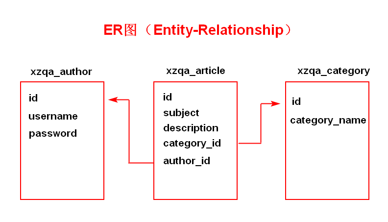
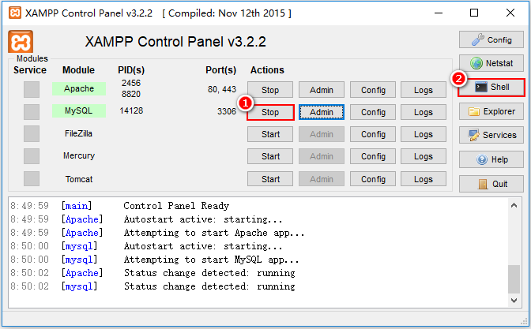
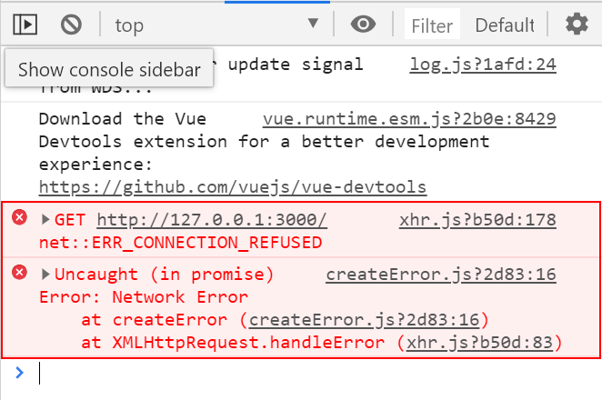
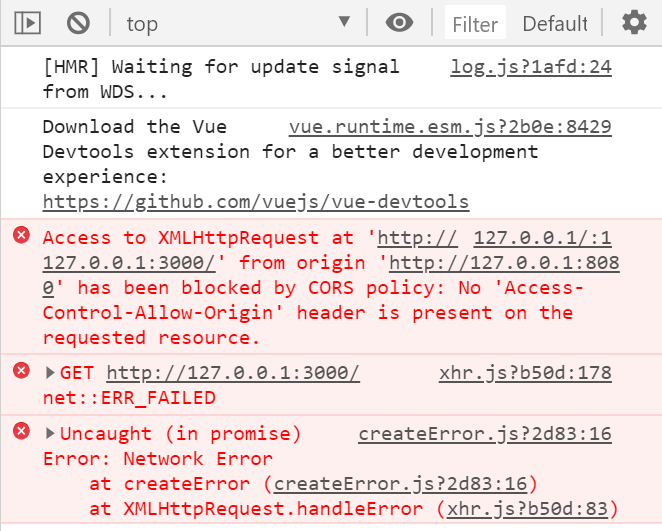
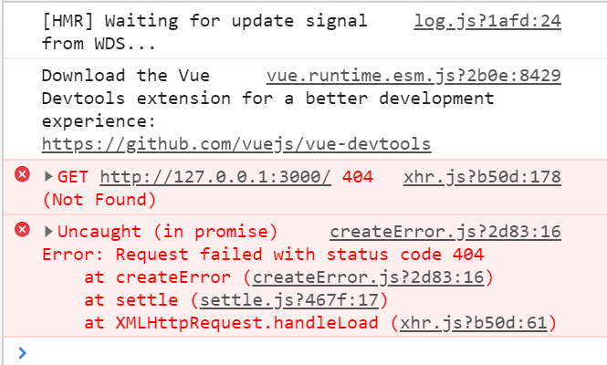
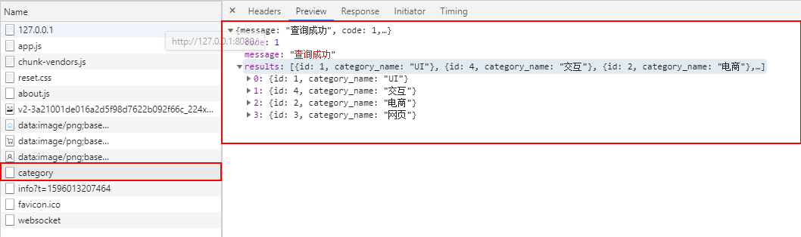
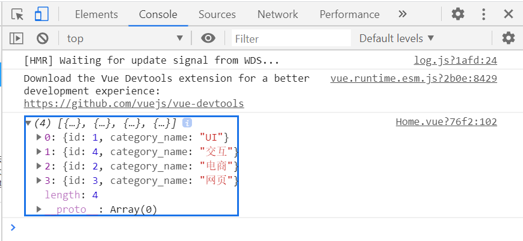

# `MintUI`-- `Unit03`

# 1.学子问答的数据表结构

数据库名称`xzqa`，编码方式 `utf8`

## 1.1 `xzqa_category`

`xzqa_category`数据表用于存储文章的分类，数据表结构如下：

| 字段名称        | 数据类型            | 是否为空 | 默认值 | 键            | 其他             | 说明       |
| --------------- | ------------------- | -------- | ------ | ------------- | ---------------- | ---------- |
| `id`            | `SMALLINT UNSIGNED` | `NO`     |        | `PRIMARY KEY` | `AUTO_INCREMENT` | 文章分类ID |
| `category_name` | `VARCHAR(30)`       | `NO`     |        | `UNIQUE KEY`  |                  | 分类名称   |

## 1.2 `xzqa_author`

`xzqa_author`数据表用于存储作者的相关信息，数据表结构如下：

| 字段名称         | 数据类型             | 是否为空 | 默认值        | 键            | 其他             | 说明               |
| ---------------- | -------------------- | -------- | ------------- | ------------- | ---------------- | ------------------ |
| `id`             | `MEDIUMINT UNSIGNED` | `NO`     |               | `PRIMARY KEY` | `AUTO_INCREMENT` | 作者ID             |
| `username`       | `VARCHAR(30)`        | `NO`     |               | `UNIQUE KEY`  |                  | 用户名             |
| `password`       | `VARCHAR(32)`        | `NO`     |               |               |                  | 用户密码,采用`MD5` |
| `nickname`       | `VARCHAR(30)`        | `YES`    | `NULL`        |               |                  | 用户昵称           |
| `avatar`         | `VARCHAR(50)`        | `NO`     | `unnamed.jpg` |               |                  | 用户头像           |
| `article_number` | `MEDIUMINT UNSIGNED` | `NO`     | `0`           |               |                  | 用户发表的文章数量 |

##  1.3 `xzqa_article`

`xzqa_article`数据表用于存储文章信息，数据表结构如下：

| 字段名称      | 数据类型            | 是否为空 | 默认值 | 键            | 其他             | 说明                                      |
| ------------- | ------------------- | -------- | ------ | ------------- | ---------------- | ----------------------------------------- |
| `id`          | `INT UNSIGNED`      | `NO`     |        | `PRIMARY KEY` | `AUTO_INCREMENT` | 文章`ID`                                  |
| `subject`     | `VARCHAR(50)`       | `NO`     |        |               |                  | 文章标题                                  |
| `description` | `VARCHAR(255)`      | `NO`     |        |               |                  | 文章简介                                  |
| `image`       | `VARCHAR(50)`       | `YES`    |        |               |                  | 文章缩略图                                |
| `content`     | `MEDIUMTEXT`        | `NO`     |        |               |                  | 文章正文                                  |
| `category_id` | `SMALLINT UNSIGNED` | `NO`     |        |               |                  | 文章分类`ID,`外键，参照分类表中的`ID`字段 |
| `author_id`   | `INT UNSIGNED`      | `NO`     |        |               |                  | 作者`ID`，外键，参照料作者表中的`ID`      |

数据表的ER图如下：



## 1.4 `MySQL`数据的导入

A.先启动`XAMPP`，再启动`MySQL`,最后单击`Shell`按钮

# 

B.在命令提示符下输入以下命令：

```shell

mysql -uroot -p < SQL脚本文件的位置及名称

```

# 2.学子问答项目的实践

## 2.1 顶部选项卡的实现

对于顶部选项卡的数量有两种实现方式：

A.静态的，指在书写`<mt-navbar>`时固定好其中包含的`<mt-tab-item>`的数量及内容

B.动态的，指`<mt-navbar>`中包含的`<mt-tab-item>`的数量及内容是数据表决定的

**在学子问答项目中包含的`xzqa_category`数据表用于存储文章的分类，所以其用作决定顶部选项卡的数量及内容。**

## · 在什么情况发向`WEB`服务器发送请求以获取分类信息?

涉及`Vue`生命周期的钩子函数：`beforeCreate`、`created`、`beforeMount`、`mounted`、`beforeUpdate`、`updated`、`beforeDestroy`、`destroyed` 

现在将采用 `mounted` 钩子函数触发时，发送请求到`WEB` 服务器，于是在`Home.vue`中进行如下修改，示例代码如下：

```html

<script>
export default{
  mounted(){
      //
  }
}    
</script>

```

现在既然要向`WEB`服务器发送请求，请问通过什么来发送请求呢？--  通过`axios`发送请求

但是，现在需要进行`axios`的安装与配置才可以使用，所以：

A.安装`Axios`

```shell

npm install --save axios

```

B.配置 -- `main.js`文件内

```javascript

//导入Axios模块
import axios from 'axios';

//配置Axios的基础地址
axios.defaults.baseURL = 'http://127.0.0.1:3000';

//在Vue的原型上扩展属性
Vue.prototype.axios = axios;

```

> **在学子问答项目案例中，`Node.js`服务器端口为`3000`**

经过上述的操作，已经完成了`Axios`的安装与配置，现在可以`Home.vue`的`mounted`钩子函数中发送请求了，示例代码如下：

```html

<script>
export default{
  mounted(){
      this.axios.get('/');
  }
}    
</script>

```

此时脚手架的运行结果如下图所示：



产生上述错误的原因是：根本没有`WEB`服务器

## · 创建`Node`服务器

脚本架在发送请求时，指定协议名称为`HTTP`，所以必须在`Node`服务器上安装`express`框架：

```shell

npm install --save express

```

安装成功后，在服务器的根目录下创建`app.js`，示例代码如下：

```javascript

//引入Express模块
const express = require('express');

//创建Express实例
const server = express();

//指定服务器的监听端口号
server.listen(3000);

```

在`VSCode`编辑器的终端中输入 `node app.js`

此时脚手架的运行结果如下图所示：



此时出现的错误原因是：脚手架的端口号与服务器端口号不一致而导致的跨域错误！所以：

## ·  解决`Node`服务器的跨域错误

在`Node`服务器上安装`CORS`模块并且进行配置：

第一步：安装

```shell

npm install --save cors

```

第二步：配置

```javascript

//引入Express模块
const express = require('express');

//引入CORS模块

const cors = require('cors');

//创建Express实例
const server = express();

//将CORS作为Server的中间件使用
server.use(cors({
  origin:['http://127.0.0.1:8080','http://localhost:8080']
}));

//指定服务器的监听端口号
server.listen(3000);

```

第三步：重新启动`Node`服务器

此时脚手架的运行结果如下：



现在产生错误的根本原因是：没有对应的`API`地址

## · 书写获取全部文章分类信息的`API`

**规定：获取全部分类信息的`API`地址为 --  `/category`，请求方式为`GET`**

所以现在必须在`Node`服务器上创建`/category`的`API`,并且请求方式为`GET`，其基本结构如下：

```javascript

server.get('/category',(req,res)=>{
  
});


```

在当前的`/category` `API`地址中要获取数据库中`xzqa_category`数据表的记录，所以还必须安装`MySQL`模块，同时进行相关的配置：

第一步：安装`MySQL`模块

```shell

npm install --save mysql

```

第二步：配置`MySQL`模块

```javascript


//引入MySQL模块

const mysql = require('mysql');

//创建MySQL连接池
const pool = mysql.createPool({
    //数据库服务器地址
    host:'127.0.0.1',
    //数据库用户名
    user:'root',
    //数据库用户密码
    password:'',
    //数据库服务器端口号
    port:3306,
    //数据库名称
    database:'xzqa',
    //编码方式
    charset:'utf8',
    //连接限制
    connectionLimit:15
});


```

第三步：在`/category`请求`API`中，获取数据表的记录并且返回到客户端(脚手架)，示例代码如下：

```javascript


//获取所有文章分类信息的API
server.get('/category',(req,res)=>{
    //SQL查询语句
    let sql = 'SELECT id,category_name FROM xzqa_category';
    //执行SQL查询语句
    pool.query(sql,(err,results)=>{
        if(err) throw err;
        //响应到客户端的信息
        res.send({message:'查询成功',code:1,results:results});
    });
});

```

第四步：重新启动`Node`服务器

此时脚手架的运行结果如下：




现在已经证明服务器返回了客户端期望的结果！！！

但是客户端还没有接收并且在页面组件中显示该结果信息，所以：

## ·  在客户端接收并显示显示信息

在刚刚发送请求的代码如下：

```javascript

mounted(){
    this.axios.get('/category');
}

```

所以现在要接收服务器返回的数据了，示例代码如下：

```javascript

mounted(){
    this.axios.get('/category').then(res=>{
    	console.log(res.data.results);
    });
}

```

此时脚本架的运行结果如下：



这些数据最终要在页面组件显示的话，必须将其存储`Vue`的一个变量中，然后再通过`v-for`指令进行循环输出就可以了，所以：

```javascript

data(){
	return {
		//用于存储文章分类信息
		category:[]
	}
}

```

另外在`mounted`的钩子函数中应该将服务器返回的数据存储到`Vue`变量中，示例代码如下：

```javascript

mounted(){
    this.axios.get('/category').then(res=>{
        this.category = res.data.results;
    });
}

```

最后通过`v-for`指令来动态决定`<mt-tab-item>`的数量及内容，示例代码如下：

```html

<mt-navbar v-model="active">
    <mt-tab-item 
    	:id="item.id" 
        v-for="(item,index) of category" 
        :key="index">
     {{item.category_name}}
    </mt-tab-item>     
</mt-navbar>

```

最后当循环输出之后发现没有任何一个顶部选项卡被选定，根本原因是因为：`active`变量原来为字符串类型，而现在为数字类型的，所以：需要将原来的`active`变量的默认值由字符串类型的`"1"`，改为整数 `1` 即可。

扩展一步：

面板的数量与顶部选项卡的数量是一致的，所以也应由`category`变量动态来决定面板的数量，故：

```html

<mt-tab-container v-model="active">
    <mt-tab-container-item 
          :id="item.id" 
          v-for="(item,index) of category" 
          :key="index">
        <!-- 单一文章信息开始 -->
        <div class="InfoItem">
            ...
        </div>
        <!-- 单一文章信息结束 -->
    </mt-tab-container-item>

</mt-tab-container>


```

作业：

**A.推倒重写**

B.文章列表的业务功能